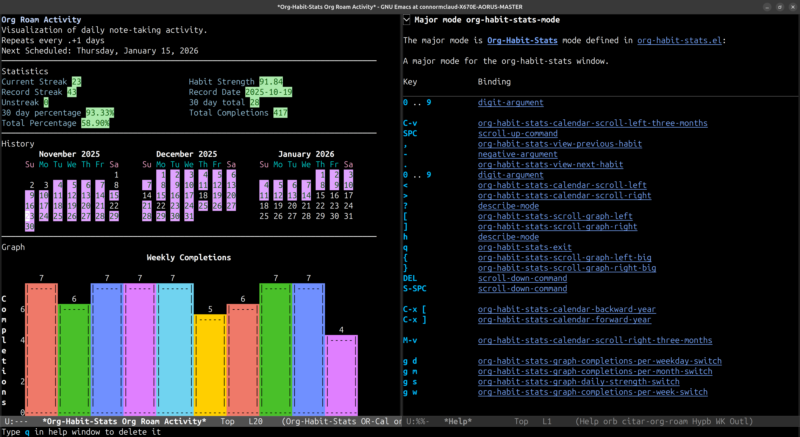

# org-roam-calendar

View your [org-roam](https://github.com/org-roam/org-roam) activity in a calendar visualization using `org-habit-stats`.

> [!WARNING]
> This is a **prototype**. It works on my machine, but no guarantees are made.



This package provides a calendar view that highlights days where `org-roam` nodes were created or modified, allowing you to easily browse your notes by date.

## Features

- **Activity Visualization**: See which days you worked on your notes.
- **Interactive Calendar**: Press `RET` on a date to see and open notes modified on that day.
- **Date Navigation**: Press `.` to jump to today, or `g` to go to any date.
- **Easy Integration**: Hooks directly into your existing `org-roam` database.
- **Filtering**: Easily filter out daily notes.

## Installation

### Manual

1. Clone this repository to your Emacs load path.
2. Require the package in your config:
   ```elisp
   (require 'org-roam-calendar)
   ```
3. M-x org-roam-calendar-open

## Configuration

The recommended way to install and configure `org-roam-calendar` is using `use-package`.

### Basic Setup with straight.el

```elisp
(use-package org-roam-calendar
  :ensure t
  :straight (:host github :repo "connormclaud/emacs_org_roam_calendar")
  :commands org-roam-calendar-open
  :bind ("C-c n o" . org-roam-calendar-open))
```

## Usage

Run `M-x org-roam-calendar-open` to open the calendar view.

- **Navigation**: Use standard calendar navigation keys.
- **View Notes**: Press `RET` on a highlighted date to select and open a note(s) modified on that day.
- **Go to Today**: Press `.` to jump the calendar to today's date.
- **Go to Date**: Press `g` to navigate to any date using `org-read-date`.
- **Cycle Dailies**: Press `/` to cycle the visibility of daily notes (`include` -> `exclude` -> `only`).

